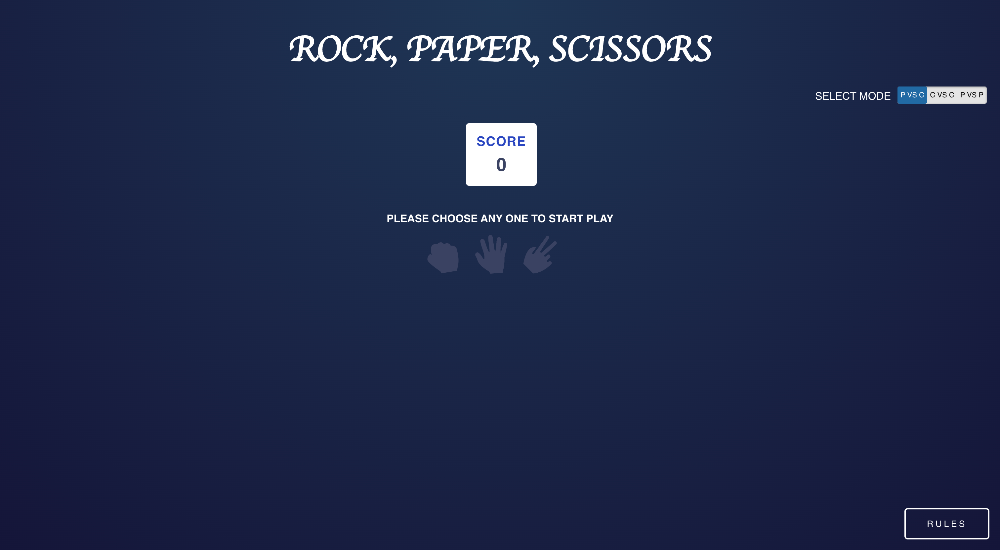

# ROCK, PAPER, SCISSORS

## Table of contents
* [General info](#general-info)
* [Technologies](#technologies)
* [Setup](#setup)
* [Screenshots](#screenshots)
* [How to Play](#how-to-play)

## General Info
Rock, Paper, Scissors Game

## Technologies
Project is created with create-react-app:
* React version: 18.2.0
* Typescript version: 4.9.4
* Node Version: 16
* Test case created with React Testing Library

## Setup

## Script to Start the Application (In Local)

In the project directory, you can run:

### To install the dependencies `npm install` 

### After Successful installation, run the application using 
`npm start`

Runs the app in the development mode.\
Open [http://localhost:3000](http://localhost:3000) to view it in the browser.

### ` npm test -- --coverage`

Launches the test runner and shows the coverage for the test case.

## Script to Start the Application (In Docker)

### Install Docker in Local

### After Successful installation, build the image using
`docker build -t rockpaperscissors .`

### After building the image, run the image using
`docker run -p 3000:3000 rockpaperscissors`

Open [http://localhost:3000](http://localhost:3000) to view it in the browser.

## Screenshots

## How to Play

1. Please Select anyone mode (If hover over the Toggle, expansion name will be visible)
   * P VS C - Player VS Computer
   * C VS C - Computer VS Computer
   * P VS P - Player VS Player
2. If Selected Mode is P VS C (Player VS Computer)
   * As a player, you have to choose one choice from either of Rock, Paper, Scissor
   * Computer Choice will be chosen randomly
   * Based on your choice and computer's choice, result will be calculated and score will be updated accordingly
   * To play again, Click Play Again to start the game again
3. If Selected Mode is C VS C (Computer VS Computer)
   * Click Button Play for Computer
   * Both Computer Choice will be chosen randomly and score will be updated accordingly
   * To play again, Click Play Again to start the game again
4. If Selected Mode is P VS P (Player VS Player)
   * As a player1, you have to choose one choice from either of Rock, Paper, Scissor
   * And also as a player2, you have to choose one choice from either of Rock, Paper, Scissor
   * Based on both player's choice, result will be calculated and score will be updated accordingly
   * To play again, Click Play Again to start the game again
5. Click on Rules to View the rules of the game
6. Score and Mode will be maintained and will be retrieved after refreshing the screen